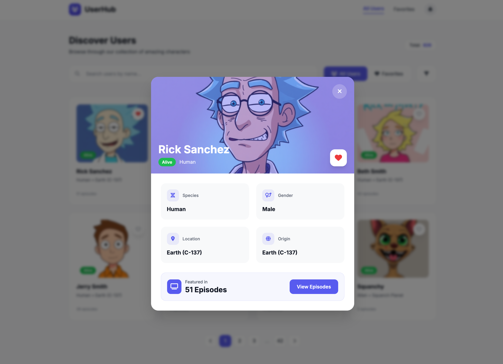

## Design referência para a aplicação

> Link para preview no UXPilot: https://uxpilot.ai/s/5d4d1b33bc9b7f18107a312e87278165

### Prints




Prompt utilizado:

```
Design a modern, minimal user management web application with a clean and elegant aesthetic. The app consumes data from Rick and Morty API and displays characters as "users".

**Design Style:**
- Clean, minimalist interface with generous white space
- Soft shadows and subtle rounded corners
- Primary color: deep purple (#6366F1) with light purple accents
- Secondary: neutral grays for text and backgrounds
- Typography: Inter or similar modern sans-serif
- Cards with subtle hover effects
- Consistent 8px spacing grid

**Pages to Design:**

1. **Home / User List Page**
   - Header with app logo/name and navigation
   - Search input field with icon (filter by name)
   - Toggle button/tab to filter favorites only
   - Grid of user cards (3-4 columns on desktop, responsive)
   - Each card shows: avatar image, name, email/status
   - Heart icon on each card for favorite toggle (filled when favorited)
   - Pagination controls at bottom OR infinite scroll indicator
   - Loading skeleton state
   - Empty state when no results

2. **User Details Page/Modal**
   - Large avatar image
   - User name as heading
   - Info sections: status, species, location, origin, episode count
   - Favorite button (prominent)
   - Back button or close modal button
   - Clean information hierarchy

3. **Favorites Page**
   - Same layout as home page
   - Shows only favorited users
   - Empty state with illustration when no favorites
   - Link to go back to all users

**Components Needed:**
- User card component
- Search input with icon
- Filter toggle/tabs (All / Favorites)
- Pagination component
- Loading spinner and skeleton cards
- Toast notification for success/error feedback
- Empty state illustrations
- Heart/favorite icon button

**Responsive Behavior:**
- Desktop: 3-4 column grid
- Tablet: 2 column grid
- Mobile: single column, bottom navigation

**Micro-interactions:**
- Card hover: subtle lift with shadow
- Favorite toggle: heart animation
- Page transitions: smooth fade
- Loading: skeleton pulse animation
```
